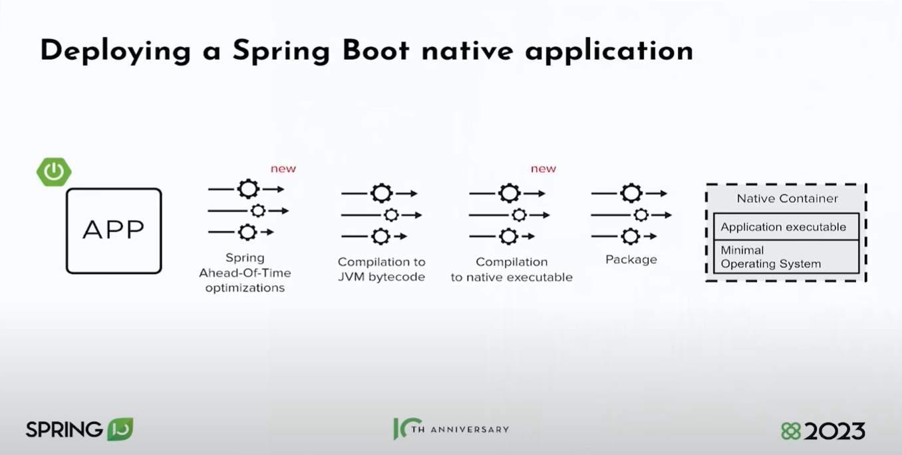
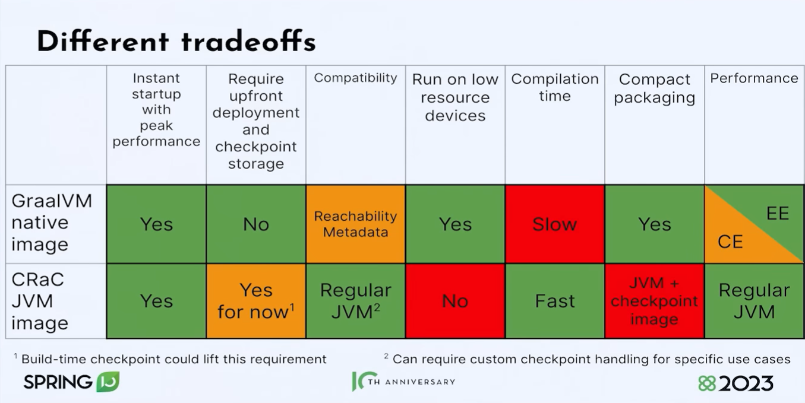
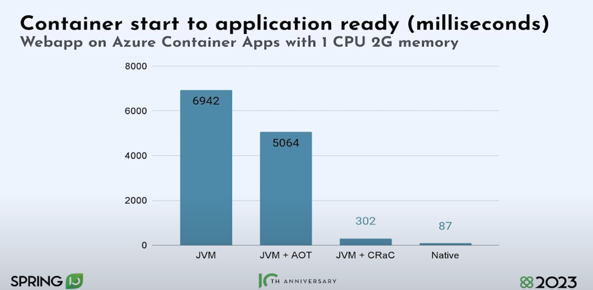

# Spring Boot 3.0 és 3.1 újdonságai

## Spring I/O 2023 - Keynote

* https://www.youtube.com/watch?v=IgmeFeTU1a4
* Spring Framework 20 éves
* Spring Boot 10 éves
* Spring Boot 3.0
	* Problem Details
	* Tracing
	* Native image
* Spring Boot 3.1 - Spring Boot 6.0
	* Testcontainers
	* Docker compose
	* SSL
	* Spring Security Authorization Server Spring Boot Starter
		* OAuth 2.0 Identification Provider (IDP)
* Java 21
	* Virtual thread: skálázhatóság új szintje
* Spring Boot 3.2 - Spring Boot 6.1 (2023. november)
	* JVM checkpoint/restore, project CRaC
	* AOT revisited
	* Data binding & validation revisited

### Scale to zero

* Native images
	* Spring AOT optimalization (reflection eliminálása, proxies, resources)
	* Native executable
	* Erőforrásigényes műveletek: runtime -> buildtime



	* Előnyök:
		* Gyors indítás
		* Nem kell bemelegedés (JIT)
		* Kevesebb memória és CPU (JIT)
		* Biztonság (nincs dinamikus betöltés)
		* Kicsi image (tárhely, hálózat)
	* https://github.com/oracle/graalvm-reachability-metadata
	* https://www.graalvm.org/native-image/libraries-and-frameworks/#
* Spring Cloud Functions
	* Deploy MVC controllers as function
* Project CRaC
	* Elindított JVM checkpoint/restore
	* Spring támogatás: Spring Framework 6.1
	* ApplicationContext lezárja a kapcsolatokat a checkpoint készítése előtt
	* Egyelőre Jetty, Tomcatnél még vannak bajok
	* Azul Zulu JDK
	* Konténerizáció esetén
		* Checkpoint készítése
		* Docker commit
	* Indítási idő csökken
	* Memóriafelhasználás nem csökken





## Gyakorlat

* Kiindulási projekt: `jtechlog-employees-sb3`

* Gradle a default a http://start.spring.io oldalon

## Migráláskor előjött problémák

Swagger: `org.springdoc:springdoc-openapi-starter-webmvc-ui`
Csomagnevek:

* `jakarta.persistence`
* `jakarta.validation`

## Docker compose támogatás (3.1)

```groovy
developmentOnly("org.springframework.boot:spring-boot-docker-compose")
developmentOnly("org.springframework.boot:spring-boot-devtools")
```

```yaml
version: '3'

services:
  mariadb:
    image: mariadb
    environment:
      MARIADB_DATABASE: employees
      MARIADB_ALLOW_EMPTY_ROOT_PASSWORD: 'yes'
      MARIADB_USER: employees
      MARIADB_PASSWORD: employees
    ports:
      - '3306:3306'
```


```java
log.info("List employees");
```

## Testcontainers támogatás (3.1)

### Tesztesetben

```groovy
testImplementation 'org.springframework.boot:spring-boot-testcontainers'
testImplementation 'org.testcontainers:junit-jupiter'
testImplementation 'org.testcontainers:mariadb'
```

```java
package employees;

import org.junit.jupiter.api.Test;
import org.springframework.beans.factory.annotation.Autowired;
import org.springframework.boot.test.context.SpringBootTest;
import org.springframework.boot.testcontainers.service.connection.ServiceConnection;
import org.springframework.test.context.jdbc.Sql;
import org.testcontainers.containers.MariaDBContainer;
import org.testcontainers.junit.jupiter.Container;
import org.testcontainers.junit.jupiter.Testcontainers;

import static org.assertj.core.api.Assertions.assertThat;
import static org.junit.jupiter.api.Assertions.assertEquals;

@SpringBootTest
@Testcontainers
class EmployeesApplicationIT {

	@Container
	@ServiceConnection
	static MariaDBContainer<?> mariadb = new MariaDBContainer<>("mariadb");

	@Autowired
	EmployeesController employeesController;

	@Test
	void saveThenFindById() {
		var created = employeesController.createEmployee(new EmployeeResource("John Doe"));
		var loaded = employeesController.findEmployeeById(created.getId());

		assertEquals("John Doe", loaded.getName());
	}
}
```

### Alkalmazás indításakor

```groovy
testImplementation("org.springframework.boot:spring-boot-devtools")
```

```java
@Configuration
public class EmployeesTestApplication {

    @Bean
    @ServiceConnection
	@RestartScope
    public MariaDBContainer<?> mariadDbContainer() {
      return new MariaDBContainer<>("mariadb")
              .withCreateContainerCmdModifier(mod -> mod.withName("employees-test-mariadb"))
              .withReuse(true);
    }

    public static void main(String[] args) {
        SpringApplication
                .from(EmployeesApplication::main)
                .with(EmployeesTestApplication.class)
                .run(args);
    }
}
```

## Problem Details (3.0)

https://blog.frankel.ch/problem-details-http-apis/

Küldés: `GET http://localhost:8080/api/employees/foo`

`application.properties`:

```properties
spring.mvc.problemdetails.enabled = true
```

`ResponseEntityExceptionHandler`

```java
@ControllerAdvice
public class EmployeesExceptionHandler {

    @ExceptionHandler
    public ProblemDetail handle(EmployeeNotFoundException exception) {
        return ProblemDetail.forStatusAndDetail(HttpStatus.NOT_FOUND, exception.getMessage());
    }

}
```

* Validation

```java
@ExceptionHandler
public ProblemDetail handle(MethodArgumentNotValidException exception) {
	ProblemDetail problemDetail = ProblemDetail.forStatusAndDetail(HttpStatus.BAD_REQUEST, "Constraint Violation");
	List<Violation> violations = exception.getBindingResult().getFieldErrors().stream()
			.map((FieldError fe) -> new Violation(fe.getField(), fe.getDefaultMessage()))
			.toList();
	problemDetail.setProperty("violations", violations);
	return problemDetail;
}
```

## Tracing (3.0)

```groovy
implementation 'org.springframework.boot:spring-boot-starter-actuator'
implementation 'io.micrometer:micrometer-tracing-bridge-otel'
implementation 'io.opentelemetry:opentelemetry-exporter-zipkin'

implementation 'net.ttddyy.observation:datasource-micrometer-spring-boot:1.0.2'
```

```properties
spring.application.name=employees
management.tracing.enabled=true
management.tracing.sampling.probability=1.0
management.zipkin.tracing.connect-timeout=5s
```

```java
@Bean
@RestartScope
@ServiceConnection(name = "openzipkin/zipkin")
public GenericContainer<?> zipkinContainer() {
	return new GenericContainer<>("openzipkin/zipkin")
			.withCreateContainerCmdModifier(mod -> mod.withName("employees-test-zipkin"))
			.withExposedPorts(9411)
			.withReuse(true);
}
```

* `spring-web` behúzza az `io.micrometer:micrometer-observation` függőséget, ebben van az `Observation`, `ObservationRegistry`
* Induláskor: `ObservationRegistry' that could not be found.`

```java
@Observed(name = "list.employees", contextualName = "list.employees", lowCardinalityKeyValues = {"framework", "spring"})
```

```java
return Observation.createNotStarted("controller.hello", observationRegistry)
				.lowCardinalityKeyValue("framework", "spring")
				.observe(() -> {
					return repository.findAllResources();
				});
```

```java
@Bean
ObservedAspect observedAspect(ObservationRegistry observationRegistry) {
	return new ObservedAspect(observationRegistry);
}
```

```groovy
implementation 'org.springframework.boot:spring-boot-starter-aop'
```

```groovy
implementation 'org.springframework.boot:spring-boot-starter-actuator'
implementation 'io.micrometer:micrometer-registry-prometheus'
```

```properties
management.endpoints.web.exposure.include=*
```

```properties
logging.pattern.console=%d{HH:mm:ss} [%X{traceId}/%X{spanId}] %clr(%-5.5p{5}) %-40.40logger{40} %m%n
```

## HTTP interface

* WebFlux
* Lombok


```groovy
implementation 'org.springframework.boot:spring-boot-starter-actuator'
implementation 'io.micrometer:micrometer-tracing-bridge-otel'
implementation 'io.opentelemetry:opentelemetry-exporter-zipkin'
```

`application.properties`

```
spring.main.web-application-type=none
```

`EmployeeResource` copy

```java
@HttpExchange("/api/employees")
public interface EmployeesService {


    @GetExchange
    List<EmployeeResource> listEmployees();
}
```

```java
@SpringBootApplication
@Slf4j
@AllArgsConstructor
public class EmployeesClientApplication implements CommandLineRunner {

	private WebClient.Builder webClientBuilder;

	public static void main(String[] args) {
		SpringApplication.run(EmployeesClientApplication.class, args);
	}


	@Override
	public void run(String... args) throws Exception {
		var webClient = webClientBuilder.baseUrl("http://localhost:8080").build();
		var clientAdapter = WebClientAdapter.forClient(webClient);
		var factory = HttpServiceProxyFactory
				.builder(clientAdapter).build();
		var client = factory.createClient(EmployeesService.class);

		var employees = client.listEmployees();
		employees.forEach(employee -> log.info("Employee: {}", employee));
	}
}
```

```properties
spring.application.name=employees-client
management.zipkin.tracing.connect-timeout=5s
management.tracing.enabled=true
management.tracing.sampling.probability=1.0
```

## Natív támogatás

```groovy
id 'org.graalvm.buildtools.native' version '0.9.27'
```

```shell
gradlew bootBuildImage
```

## CRaC

* https://github.com/sdeleuze/spring-boot-crac-demo

## `InMemoryHttpExchangeRepository`

